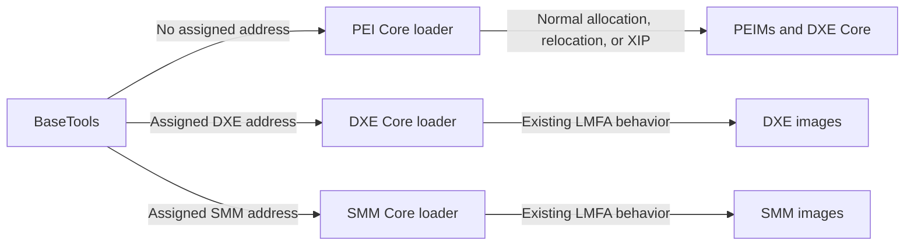

# RFC: Drop PEI Core Load at Fixed Address Support

## Metadata

- **RFC Number**: 0006
- **Title**: Drop PEI Core Load at Fixed Address Support
- **Status**: Draft

## Change Log

- 2026-09-24: Initial RFC created

## Motivation

EDK2's Load Module at Fixed Address feature allows the build system to request preferred addresses for a firmware
module to be loaded. `PcdLoadModuleAtFixAddressEnable` controls the feature and the build system records each assigned
address in otherwise unused fields in the image section headers. During boot the PE/COFF loaders read those
addresses and attempt to honor them.

This RFC proposes removing only the PEI Core portion of Load Module at Fixed Address feature. PEIMs can be considered
temporary code. The output of the PEIMs (HOBs) are the only data which endures to the DXE phase. The PEIMs loaded
into memory stop being relevant as soon as the DXE phase takes control.

The PEI implementation adds complexity across both BaseTools and PEI Core:

- BaseTools classifies PEI Core, PEIM, and DXE Core images, calculates a PEI code region, rebases the images, stores the
  assigned addresses in image section headers, patches `PcdLoadFixAddressPeiCodePageNumber`, and reports the region in
  the platform map file.
- To fulfill Fixed Address loading features in PEI, code in the PEI dispatcher consumes, converts and corrupts existing
  Resource Descriptor HOBs in an attempt to satisfy a Load Module at Fixed Address request.
- PEI Core carries Load at Fixed Address specific state in `PEI_CORE_INSTANCE`.

Despite this code bloat, the PEI implementation does not guarantee fixed placement. If an image has no valid assigned
address, its assigned range is unavailable, or the range overlaps another image, PEI Core falls back to allocating
pages through the normal PEI Services path.

A survey of the edk2 platforms found no direct consumption of `PcdLoadFixAddressPeiCodePageNumber`. The PEI-specific
support therefore has an ongoing maintenance and test burden with available test scenarios. Removing it simplifies
the PEI state.

## Technology Background

Load Module at Fixed Address was added to EDK2 in 2010 by
[commit 54ea99a798f7](https://github.com/tianocore/edk2/commit/54ea99a798f7d714b59503fcc21ee97878bc6492).
The feature supports two configurations:

- A positive `PcdLoadModuleAtFixAddressEnable` value specifies an absolute top address.
- `0xFFFFFFFFFFFFFFFF` specifies addresses as offsets from a platform-specific top-of-memory address selected at
  runtime.

When Load Module at Fixed Address is enabled, BaseTools divides the fixed-address space into PEI, DXE boot-time,
DXE runtime, and SMM code regions. For PEI images, BaseTools rebases the image and stores either its absolute
address or its signed offset from the top address in the first non-code section header. PEI Core retrieves this
value in `GetPeCoffImageFixLoadingAssignedAddress()` and validates it with `CheckAndMarkFixLoadingMemoryUsageBitMap()`.

The PEI code region size is communicated to PEI Core through the build-generated
`PcdLoadFixAddressPeiCodePageNumber` value. PEI Core uses that size when positioning permanent PEI memory and when
allocating its bitmap and reserved PEI code pages.

The normal PEI image-loading behavior is already the fallback when fixed placement cannot be used. Relocatable images
are allocated and relocated by PEI Core, while eligible execute-in-place images continue to execute from their
firmware volume.

Relevant current implementation:

- [PEI image loader](https://github.com/tianocore/edk2/blob/master/MdeModulePkg/Core/Pei/Image/Image.c)
- [PEI dispatcher and permanent-memory setup](https://github.com/tianocore/edk2/blob/master/MdeModulePkg/Core/Pei/Dispatcher/Dispatcher.c)
- [PEI Core instance state](https://github.com/tianocore/edk2/blob/master/MdeModulePkg/Core/Pei/PeiMain.h)
- [BaseTools fixed-address layout](https://github.com/tianocore/edk2/blob/master/BaseTools/Source/Python/build/build.py)
- [LMFA PCD declarations](https://github.com/tianocore/edk2/blob/master/MdeModulePkg/MdeModulePkg.dec)

## Goals

1. Remove fixed-address placement of images loaded by PEI Core.
2. Simplify PEI Core image loading and permanent-memory initialization.
3. Remove the PEI-specific Load Module at Fixed Address support for PEIMs in BaseTools.
4. Keep Load Module at Fixed Address behavior for images loaded by DXE Core and SMM Core.
5. Keep normal PEI image-loading, relocation, shadowing, and execute-in-place behavior.

## Requirements

1. PEI Core must no longer decode, validate, reserve, or track build-assigned image addresses.
2. BaseTools must no longer rebase PEI Core, PEIM for Load Module at Fixed Address.
3. `PcdLoadFixAddressPeiCodePageNumber` and all of its consumers must be removed.
4. `PcdLoadModuleAtFixAddressEnable` and the DXE/SMM LMFA PCDs must remain available.
5. PEI's memory layout must continue to preserve DXE memory regions when DXE Load Module At Fixed Address is enabled.

## UEFI/PI Specification Impact

This change has no UEFI or PI specification impact. LMFA, its PCDs, its build option, and its image section-header
encoding are EDK2 implementation details. The PI image-loading interfaces do not require PEI Core to load an image
at a build-assigned address.

No Code First issue is required.

## Backward Compatibility

This is a breaking change for a platform that depends on a PEIM or DXE Core executing at the address assigned by
BaseTools.

- **Breaking changes**: PEI Core, PEIMs, and DXE Core will no longer be assigned fixed addresses by BaseTools or loaded
  at those addresses by PEI Core. `PcdLoadFixAddressPeiCodePageNumber` will be removed.
- **Unaffected behavior**: DXE drivers, runtime drivers, and SMM modules can continue to use this feature. The
  `PcdLoadModuleAtFixAddressEnable` setting and `FIX_LOAD_TOP_MEMORY_ADDRESS` build option remain valid for those
  phases.
- **Migration path**: Platforms should remove any override or consumption of
  `PcdLoadFixAddressPeiCodePageNumber` and must not rely on fixed PEIM or DXE Core addresses. Debuggers and tooling
  should obtain actual image addresses from debug logs, module-load records, or platform debug-agent interfaces.S
- **Deprecation**: The removal will follow the EDK2 breaking-change process. No compatibility layer is proposed
  because retaining a compatibility path would retain the implementation this RFC is intended to remove.

The normal loader fallback means PEI images that merely enabled this for convenience, rather than requiring their
assigned addresses, will continue to load and execute.

## Platform/Package Impact

- **MdeModulePkg**
  - Remove the PEI-specific Load Module at Fixed Address code from `MdeModulePkg/Core/Pei`.
  - Remove `PcdLoadFixAddressPeiCodePageNumber` from `MdeModulePkg.dec` and `MdeModulePkg.uni`.
  - Keep the shared, DXE-specific, and SMM-specific code.
- **BaseTools**
  - Stop collecting and rebasing images loaded by PEI Core.
  - Stop patching and reporting the PEI code page count.
  - Preserve fixed-address processing for DXE and SMM modules.
- **Platforms**
  - Platforms that use this feature should either XIP their module, or modify their PEIMs to not rely
    on loading at a fixed address.
  - No changes are expected for the known upstream platforms because none currently enable the feature.

## Unresolved Questions

- Should this behavior be retired for DXE and SMM environments at well?
- Are there downstream platforms that require a fixed address for DXE Core even though DXE Core is loaded through PEI
  Core?

These questions will be resolved during the RFC review process.

## Prior Art/Related Work

The Standalone MM Core removed Load Module at Fixed Address support in
[tianocore/edk2#5168](https://github.com/tianocore/edk2/pull/5168). That change established precedent for removing
phase-specific Load Module at Fixed Address. 

PEI Core already uses its standard page-allocation and relocation path whenever the feature is disabled or a fixed
address cannot be used. This RFC makes that existing fallback the only path for images loaded by PEI Core.

## Alternatives

### Alternative 1: Keep the Existing PEI Implementation

- **Pros**: No downstream compatibility impact.
- **Cons**: Retains an untested image-loading path, PEI Core state and bitmap management, special section-header
  encoding, a build-generated PCD, and BaseTools rebasing logic.
- **Why not chosen**: There is no known upstream consumer to justify the implementation and maintenance cost.

### Alternative 2: Deprecate PEI but Retain It Indefinitely

- **Pros**: Gives downstream platforms unlimited migration time.
- **Cons**: Does not achieve the simplification goal and leaves unclear ownership for testing and maintenance.
- **Why not chosen**: The EDK2 breaking-change process already provides a communicated migration period.

### Alternative 3: Remove from All Phases

- **Pros**: Maximizes simplification in BaseTools and all firmware cores.
- **Cons**: Broadens the compatibility impact to DXE and SMM consumers and requires separate analysis of those use
  cases.
- **Why not chosen**: This proposal is limited to the unconsumed PEI Core path. DXE may have some use, but SMM
  is another story and should probably get removed. Knowing exactly where something is loaded in SMM seems dangerous
  as an attack vector, especially given the number of SMM vulnerabilities that continue to be found.

### Alternative 4: Keep Fixed Placement for DXE Core Only

- **Pros**: Preserves a stable DXE Core address while removing PEIM bitmap tracking.
- **Cons**: PEI Core would still need the section-header decoding and special fixed-address loading path for one image,
  and BaseTools would still need to classify DXE Core as part of the PEI fixed-address region.
- **Why not chosen**: No upstream requirement for fixed DXE Core placement is known, and this would preserve most of
  the cross-layer contract.

## Implementation Design

### Architecture Overview

After this change, BaseTools assigns fixed addresses only to modules to two phases, DXE and SMM.



PEI Core continues to account for the DXE fixed-address regions when positioning permanent PEI
memory. It no longer reserves a PEI code subregion or places images within one.

### Detailed Design

1. **Remove PEI image fixed-placement logic**
   - Remove `CheckAndMarkFixLoadingMemoryUsageBitMap()`.
   - Remove `GetPeCoffImageFixLoadingAssignedAddress()`.
   - Remove the Load Module at Fixed Address branch from the PEI PE/COFF load path.
   - Always use the existing normal allocation path for relocatable images loaded by PEI Core.

2. **Remove PEI Load Module at Fixed Address state and initialization**
   - Remove `PeiCodeMemoryRangeUsageBitMap` from `PEI_CORE_INSTANCE`.
   - Remove allocation of the bitmap when PEI Core reenters from permanent memory.
   - Remove allocation of the fixed PEI code pages.
   - Keep the top-address and memory-layout state required to reserve the DXE regions.

3. **Remove the PEI code-page PCD**
   - Remove `PcdLoadFixAddressPeiCodePageNumber` from MdeModulePkg declarations, localization strings, INF
     consumption, and source.
   - Calculate the PEI permanent-memory layout using only the fixed DXE boot-time and runtime code sizes.

4. **Update BaseTools**
   - Do not add PEI Core, PEIM, combined PEIM/driver modules, or DXE Core to the fixed-address rebase list.
   - Remove the PEI code-size accumulator and the `PcdLoadFixAddressPeiCodePageNumber` patch operation.
   - Remove the PEI code-page entry from the map output, subject to the transition question above.
   - Keep DXE boot-time, DXE runtime, and SMM classification, rebasing, PCD patching, and map output unchanged.
   - Remove PEI-specific fixed-address constants that no longer have consumers.

5. **Documentation cleanup**
   - Update BaseTools documentation that describes the map and PEI code region.
   - Document that `FIX_LOAD_TOP_MEMORY_ADDRESS` applies only to the remaining DXE and SMM consumers.

### Code Examples

A platform that still uses this feature for DXE or SMM keeps the shared setting:

```ini
[PcdsFixedAtBuild]
  gEfiMdeModulePkgTokenSpaceGuid.PcdLoadModuleAtFixAddressEnable|0xFFFFFFFFFFFFFFFF
```

Any platform override of the removed PEI-specific value must be deleted:

```diff
 [PcdsPatchableInModule]
-  gEfiMdeModulePkgTokenSpaceGuid.PcdLoadFixAddressPeiCodePageNumber|0
```

No replacement PEI PCD is required.

## Testing Strategy

1. Build representative IA32, X64 with disabled to verify that the default build behavior is unchanged.
2. Ask the community if anyone uses the load module at fixed address support to see if there is an existing
   test case available.
   - PEIMs and DXE Core load through the normal PEI allocation or execute-in-place paths.
   - PEI dispatch, shadowing, and temporary-to-permanent-memory migration complete successfully.
   - DXE boot-time and runtime drivers still load at their BaseTools-assigned addresses.
   - SMM modules still load at their assigned addresses.
3. Exercise normal boot and verify behavior unchanged.
4. Verify the generated platform map contains correct DXE and SMM fixed-address ranges and no assigned PEI addresses.
5. Add or update BaseTools tests to verify module classification, page-count patching, and map generation after removal
   of the PEI region.
6. Run package CI, BaseTools unit tests, and representative platform boot tests.

## Migration/Adoption Plan

1. **Phase 1 - Announce deprecation**: Publish the accepted RFC and add the breaking-change notice. Ask downstream
   consumers to report a dependency on fixed PEIM or DXE Core addresses.
2. **Phase 2 - Coexistence release**: Where practical, add build-time deprecation diagnostics for explicit use of
   `PcdLoadFixAddressPeiCodePageNumber` while retaining the old implementation for one stable-tag development cycle.
3. **Phase 3 - Remove PEI support**: Merge the coordinated MdeModulePkg and BaseTools changes. Remove the PCD and
   publish migration guidance in the release notes.

The exact stable tags will be selected through the EDK2 breaking-change process. The implementation should land
early in a development cycle to maximize platform validation time.

## Guide-Level Explanation

### For Package Developers

PEIMs must not assume that BaseTools or PEI Core will place them at a fixed RAM address. PEIMs should remain
relocatable unless they are deliberately designed for execute-in-place operation. Debug or communication mechanisms
must discover the loaded image address at runtime rather than embedding the map address.

No package should consume `PcdLoadFixAddressPeiCodePageNumber` after this change.

### For Platform Developers

Platforms that do not enable this require no changes.

Platforms that enable this should:

1. Remove references to `PcdLoadFixAddressPeiCodePageNumber`.
2. Check scripts, debugger configuration, measurements, and inter-module communication for assumptions about PEIM or
   DXE Core addresses.
3. Continue using `PcdLoadModuleAtFixAddressEnable` only if fixed DXE or SMM placement is required.
4. Validate that the PEI permanent-memory region and remaining DXE fixed-address regions do not overlap.

### For End Users (if applicable)

No user-visible firmware behavior is expected. This is an internal build and image-loading change. Firmware images
should continue to boot normally, but their PEIM and DXE Core runtime addresses may differ between builds or boots.
